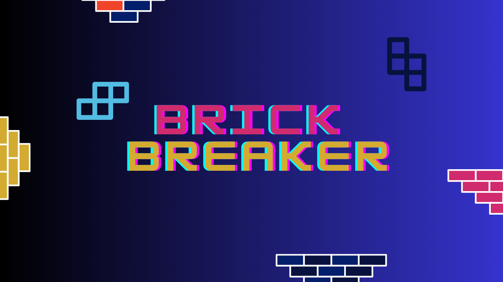

# Brick Breaker

Classic break-breaker game clone made using pygame utilities. The program uses simple shape drawing methods and collision detection using screen dimensions and collision methods.
 

Default screen resolution is 1280x720.

## Score System
Each ball hit on brick increments the score by 1. High Score record is kept by saving and loading the high score in a file "high_score.txt".

 
Both Score and High Score are displayed in the lower left corner of the screen when game is running:
  

   

## Paddle, Ball and Brick Setup

Dimensions, colors, and (x, y) coordinates are defined for each element to be drawn. Rect is a built in class in pygame that handles shape dimensions useful for collision detection.
 

 
The bricks start off as Orange but change color on each hit.
  

  
    
  
    
  

## Collision Detection
Collision of the ball with paddle, walls and bricks has been implemented.
 
- **Collision with Walls**
   Done using comparison with ball and screen dimension. The ball direction is adjusted accordingly.

 

- **Collision with Paddle**
  Done using built-in pygame method to see if Rect objects are colliding.

 

- **Collision with Bricks**
  Done using built-in pygame coliderect method to see if Rect objects are colliding. Checked for all present bricks currently not destroyed.

## Game Over / Win Screens
Font rendering is used from pygame to display GAME OVER message if ball goes below paddle. WIN is displayed when all bricks are destroyed without failing.
  
In both screens PLAY AGAIN and QUIT are also displayed which act as buttons to restart the game or exit the game window respectively.

  
    
  

